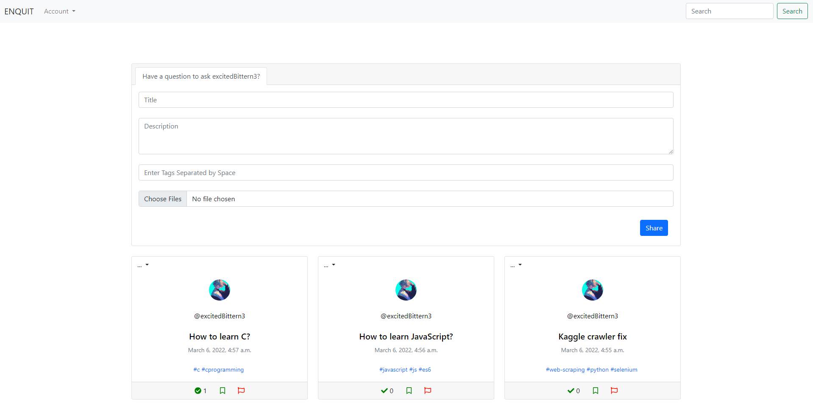
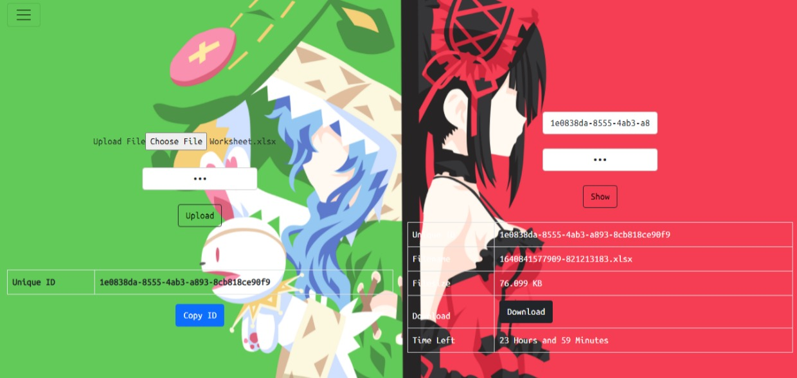

# Software Engineer (Data & Backend)

## Skills

**Programming Languages:** Python, JavaScript, Java, TypeScript, SQL, C, C++, PHP, Golang

**Cloud Platform:** AWS(Amazon Web Services), GCP(Google Cloud Platform)

**Data Engineering:** Apache Airflow, Apache Kafka, Apache Spark, Pandas, Numpy

**Front-End Development:** HTML, CSS, React, Bootstrap, jQuery, SASS

**Backend Development:** Node.js, Express, FastAPI, Django, Flask

**Databases:** Mongo, MySQL, Redis

**DevOps & Tools:** Linux, Git, Docker

**Automation & Web Scraping:** Selenium, Puppeteer

 

## Education

  
  Bachelors of Science in Information Technology | University Of Mumbai (July 2019 - May 2022)

 

## Work Experience

  
  <strong>Software Engineer | Findem Inc. (May 2022 - Present)</strong>

- Contribute to backend development.
- Design, deploy, and automate data pipelines for seamless data flow.
- Develop robust data correlation and merging algorithms.
- Create health checks, monitoring frameworks, and internal utility tools.
- Parse and aggregate unstructured data efficiently.
- Identify opportunities for data acquisition to enrich insights.
- Explore methods to improve data quality and reliability.
- Manage complex data workflows for efficient data processing.

**Skills Used:** Apache Airflow, Docker, AWS, GCP, MongoDB, Express, TypeScript, JavaScript, Python, Flask, Git, Selenium, Puppeteer

 

  
  <strong>Data Engineering Intern | Findem Inc. (May 2021 - May 2022)</strong>

- Develop algorithms to transform data into useful, actionable information.
- Analyze and organize raw data.
- Build algorithms and prototypes.
- Explore ways to enhance data quality and reliability.
- Identify opportunities for data acquisition.
- Parsing unstructured data and aggregation.

**Skills Used:** GCP, JavaScript, Python, Git, Selenium, Puppeteer

 

  
  <strong>Full-Stack Developer | NiTech (July 2020 - May 2021)</strong>

- Designed, developed, and maintained the data pipeline of a web application, integrating multiple data sources with the backend powered by PHP's Laravel.
- Used Python's Selenium to scrape and extract data from various web sources, and implemented data cleaning, correlation, and merging algorithms to ensure high data quality.
- Deployed the data pipeline on a Linux server for a client based in Montenegro, ensuring smooth data transfer and seamless integration with existing systems.

**Skills Used:** Linux, MySQL, PHP, Python, Git, Selenium, React

 

  
  <strong>Program Manager Intern | Lantern Edusport Foundation (May 2020 - July 2020)</strong>

- Sharing learning material and tasks to students according to a monthly calendar.
- Assess student work and identify areas for improvement.
- Engaging with all students to make communication easy and transparent.
- Producing accurate and timely reporting throughout the course of the program.
- Analyzing program risks and communicating with the core team.

**Skills Used:** Teaching, Communication, Problem Solving

 

## Projects

### Social Media Profile Scraper

Get social media's public profile data using scripts provided in this project. Contains scripts for Facebook, Instagram, Twitter, GitHub, Medium, and Pinterest. It uses python's selenium framework.

**Technologies**: Python, Selenium and Requests.

 

### Twitter Scraper Selenium

Twitter scraper is a maintained python library to scrape data from Twitter profiles, keywords, or hashtags.
- User can get the data in JSON format or even the CSV format.
- It is a headless mode browser automation.
- It is available on PyPi as well.

**Technologies**: Python, Selenium and Requests.

 

### Facebook Page Scraper

Facebook Page scraper is maintained python library to extract post's data from the Facebook page's front end.
- Extract data without getting blocked even a single time, no problem with getting your IP blocked.
- Post's data can be extracted in form of JSON as well as CSV files very easily.
- Made with Python, simple to import and install via pip

**Technologies**: Python, Selenium and Requests.

 

### Enquit

Enquit is an anonymous social question and answer platform designed to foster open communication without compromising user privacy. On Enquit, users can freely ask and answer questions on any topic, whether it’s personal, professional, or just out of curiosity, all while maintaining complete anonymity. The platform provides a safe space for individuals to share their thoughts, seek advice, or engage in discussions without the fear of revealing their identity.

Whether you're looking to get honest feedback, share opinions, or simply learn from the community, Enquit ensures your privacy is always protected. With its user-friendly interface and focus on confidentiality, Enquit is the ideal place for anyone seeking a judgment-free zone to ask questions, share knowledge, and connect with others.

**Technologies**: Python, Django, SQLite, HTML, CSS, TypeScript and Bootstrap

 

### Filereal

Filereal is a cutting-edge platform designed for seamless, anonymous file sharing. With Filereal, users can effortlessly upload and share up to 10 files every 30 minutes, without the need for registration or personal information. Whether you're collaborating on projects, sharing personal files, or distributing content, Filereal ensures that your privacy is maintained throughout the entire process. It’s perfect for anyone looking for a quick, secure, and easy way to share files with colleagues, friends, or online communities while keeping their identity completely anonymous.

Filereal’s intuitive interface and simple functionality make it accessible to users of all levels, offering a robust solution for time-sensitive file sharing. Enjoy the freedom to share without constraints, all while maintaining top-tier security and privacy standards. With Filereal, sharing files has never been more efficient or secure!

**Technologies**: Node, Express, MongoDB, Bootstrap and React

 

## Certificates

  

    
    <strong><a style="font-size: 1.1em; color: #333;" href="https://freecodecamp.org/certification/sajidshaikh/responsive-web-design" target="_blank">Responsive Web Design</a></strong>
  

  Freecodecamp - February 2019

  

    
    <strong>
    <a style="font-size: 1.1em; color: #333;" href="https://freecodecamp.org/certification/sajidshaikh/data-visualization" target="_blank"> Data Visualization </a>
    </strong>
  

  Freecodecamp - March 2021

  

    
    <strong>
    <a style="font-size: 1.1em; color: #333;" href="https://freecodecamp.org/certification/sajidshaikh/information-security-v7" target="_blank">Information Security </a>
    </strong>
  

  Freecodecamp - March 2021

  

    
    <strong>
    <a style="font-size: 1.1em; color: #333;" href="https://freecodecamp.org/certification/sajidshaikh/javascript-algorithms-and-data-structures" target="_blank">Javascript Algorithms and Data Structures</a>
    </strong>
  

  Freecodecamp - March 2021

  

    
    <strong>
    <a style="font-size: 1.1em; color: #333;" href="https://freecodecamp.org/certification/sajidshaikh/scientific-computing-with-python-v7" target="_blank">Scientific Computing with Python</a>
    </strong>
  

  Freecodecamp - March 2021

  

    
    <strong style="font-size: 1.1em; color: #333;">
    <a style="font-size: 1.1em; color: #333;" href="https://freecodecamp.org/certification/sajidshaikh/apis-and-microservices" target="_blank">Back End Development and APIs</a>
    </strong>
  

  Freecodecamp - November 2020

  

    
    <strong>
    <a style="font-size: 1.1em; color: #333;" href="https://www.hackerrank.com/certificates/b0fadb25235f" target="_blank">Rest API Certificate</a>
    </strong>
  

  HackerRank - October 2020

  

    
    <strong>
    <a style="font-size: 1.1em; color: #333;" href="https://www.udemy.com/certificate/UC-604674cf-15e9-4f0a-aa21-752999249984/" target="_blank">React JS- Complete Guide for Frontend Web Development [2022]</a>
    </strong>
  

  Udemy - September 2022

  

    
    <strong>
    <a style="font-size: 1.1em; color: #333;" href="https://www.udemy.com/certificate/UC-d070f93f-2a06-4ded-8913-91bae72db62f/" target="_blank">Practical Web Development</a>
    </strong>
  

  Udemy - March 2021

  

    
    <strong>
    <a style="font-size: 1.1em; color: #333;" href="https://www.udemy.com/certificate/UC-95a4d33a-1e7c-4218-a98c-d258ead5ca06/" target="_blank">Python Django Full Stack Developer</a>
    </strong>
  

  Udemy - March 2021

  

