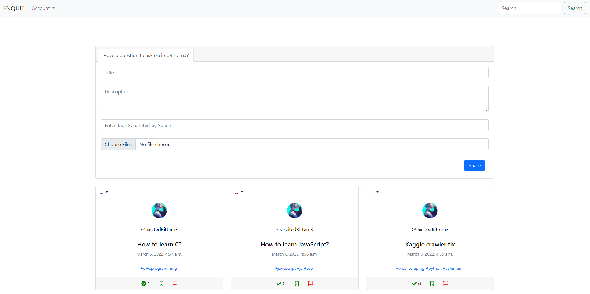
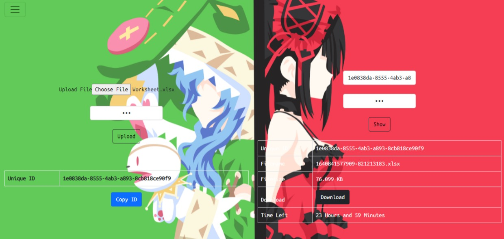

# Software Engineer (Full-Stack & Data Engineering)

## Skills

**Programming Languages:** Python, JavaScript, Java, TypeScript, SQL, C, C++, PHP, Golang

**Cloud Platform:** AWS (Amazon Web Services), GCP (Google Cloud Platform)

**Data Engineering:** Apache Airflow, Apache Kafka, Apache Spark, Pandas, Numpy

**Front-End Development:** HTML, CSS, React, Bootstrap, jQuery, SASS

**Backend Development:** Node.js, Express, FastAPI, Django, Flask

**Databases:** Mongo, MySQL, Redis

**DevOps & Tools:** Linux, Git, Docker

**Automation & Web Scraping:** Selenium, Puppeteer

 

## Education

  
  Bachelors of Science in Information Technology | University Of Mumbai (July 2019 - May 2022)

 

## Work Experience

  &nbsp;<strong> Software Engineer 2 - Data (Previously Data Engineering Intern & Software Engineer) | Findem Inc. (May 2021 - Present)</strong>

- Led development and optimization of scalable data infrastructure and AI-driven ingestion workflows for
the People Intelligence Platform.
- Built and scaled backend APIs, microservices, and large-scale ingestion pipelines processing 500M+
vendor records and 600M+ profile updates for enterprise clients.
- Developed 16+ automated data pipelines for profile ingestion and enrichment from platforms including
Doximity, ArtStation, Twitter/X, and other public sources.
- Built anomaly-detection pipelines leveraging AI to recreate and validate client search experiences,
helping identify inconsistencies and data discrepancies.
- Partnered with Product teams to build an AI-assisted fraud detection pipeline leveraging LLMs for
anomaly and profile-risk analysis.
- Contributed to AI-powered identity resolution services used to map and associate social media profiles
with LinkedIn entities.
- Built privacy automation APIs handling millions of opt-out and compliance-related requests, significantly
reducing manual operational overhead.
- Designed web crawlers, parsers, and workflow automation systems to improve large-scale data
acquisition reliability and throughput.
- Built and optimized internal ETL workflows to improve ingestion efficiency, monitoring, and data
consistency.
- Debugged and optimized complex multi-layer distributed systems and workflow pipelines to improve
reliability, scalability, and operational performance.
- Mentored and supported engineering initiatives around automation, data quality enforcement, and
large-scale workflow orchestration.

**Skills Used:** Apache Airflow, Docker, AWS, GCP, MongoDB, Express, TypeScript, JavaScript, Python, Flask, Git, Selenium, Puppeteer, Design Patterns, System Design
 

  
  <strong>Full-Stack Developer | NiTech (July 2020 - May 2021)</strong>

- Designed, developed, and maintained the data pipeline of a web application, integrating multiple data sources with the backend powered by PHP's Laravel.
- Used Python's Selenium to scrape and extract data from various web sources, and implemented data cleaning, correlation, and merging algorithms to ensure high data quality.
- Deployed the data pipeline on a Linux server for a client based in Montenegro, ensuring smooth data transfer and seamless integration with existing systems.

**Skills Used:** Linux, MySQL, PHP, Python, Git, Selenium, React

 

  
  <strong>Program Manager Intern | Lantern Edusport Foundation (May 2020 - July 2020)</strong>

 Lantern Edusport Foundation – A nonprofit organization dedicated to promoting education and sports among underserved communities.

- Coordinated the distribution of learning materials and assigned tasks to students, adhering to a structured monthly calendar to ensure smooth program execution.
- Assessed student submissions to identify areas for improvement and provided constructive feedback to support their academic and personal development.
- Fostered open and transparent communication by actively engaging with students, addressing queries, and building a supportive learning environment.
- Prepared and delivered accurate and timely reports to stakeholders, tracking progress and milestones throughout the program.
- Conducted risk analysis for program activities, proactively identifying potential challenges and collaborating with the core team to implement effective solutions.

**Skills Used:** Teaching, Communication, Problem Solving

 

## Projects

### Social Media Profile Scraper

Get social media's public profile data using scripts provided in this project. Contains scripts for Facebook, Instagram, Twitter, GitHub, Medium, and Pinterest. It uses python's selenium framework.

**Technologies**: Python, Selenium and Requests.

 

### Twitter Scraper Selenium

Twitter scraper is a maintained python library to scrape data from Twitter profiles, keywords, or hashtags.
- User can get the data in JSON format or even the CSV format.
- It is a headless mode browser automation.
- It is available on PyPi as well.

**Technologies**: Python, Selenium and Requests.

 

### Facebook Page Scraper

Facebook Page scraper is maintained python library to extract post's data from the Facebook page's front end.
- Extract data without getting blocked even a single time, no problem with getting your IP blocked.
- Post's data can be extracted in form of JSON as well as CSV files very easily.
- Made with Python, simple to import and install via pip

**Technologies**: Python, Selenium and Requests.

 

### Enquit

Enquit is an anonymous social question and answer platform designed to foster open communication without compromising user privacy. On Enquit, users can freely ask and answer questions on any topic, whether it’s personal, professional, or just out of curiosity, all while maintaining complete anonymity. The platform provides a safe space for individuals to share their thoughts, seek advice, or engage in discussions without the fear of revealing their identity.

Whether you're looking to get honest feedback, share opinions, or simply learn from the community, Enquit ensures your privacy is always protected. With its user-friendly interface and focus on confidentiality, Enquit is the ideal place for anyone seeking a judgment-free zone to ask questions, share knowledge, and connect with others.

**Technologies**: Python, Django, SQLite, HTML, CSS, TypeScript and Bootstrap

 

### Filereal

Filereal is a cutting-edge platform designed for seamless, anonymous file sharing. With Filereal, users can effortlessly upload and share up to 10 files every 30 minutes, without the need for registration or personal information. Whether you're collaborating on projects, sharing personal files, or distributing content, Filereal ensures that your privacy is maintained throughout the entire process. It’s perfect for anyone looking for a quick, secure, and easy way to share files with colleagues, friends, or online communities while keeping their identity completely anonymous.

Filereal’s intuitive interface and simple functionality make it accessible to users of all levels, offering a robust solution for time-sensitive file sharing. Enjoy the freedom to share without constraints, all while maintaining top-tier security and privacy standards. With Filereal, sharing files has never been more efficient or secure!

**Technologies**: Node, Express, MongoDB, Bootstrap and React

 

## Certificates

  

    
    <strong><a style="font-size: 1.1em; color: #333;" href="https://freecodecamp.org/certification/sajidshaikh/responsive-web-design" target="_blank">Responsive Web Design</a></strong>
  

  Freecodecamp - February 2019

  

    
    <strong>
    <a style="font-size: 1.1em; color: #333;" href="https://freecodecamp.org/certification/sajidshaikh/data-visualization" target="_blank"> Data Visualization </a>
    </strong>
  

  Freecodecamp - March 2021

  

    
    <strong>
    <a style="font-size: 1.1em; color: #333;" href="https://freecodecamp.org/certification/sajidshaikh/information-security-v7" target="_blank">Information Security </a>
    </strong>
  

  Freecodecamp - March 2021

  

    
    <strong>
    <a style="font-size: 1.1em; color: #333;" href="https://freecodecamp.org/certification/sajidshaikh/javascript-algorithms-and-data-structures" target="_blank">Javascript Algorithms and Data Structures</a>
    </strong>
  

  Freecodecamp - March 2021

  

    
    <strong>
    <a style="font-size: 1.1em; color: #333;" href="https://freecodecamp.org/certification/sajidshaikh/scientific-computing-with-python-v7" target="_blank">Scientific Computing with Python</a>
    </strong>
  

  Freecodecamp - March 2021

  

    
    <strong style="font-size: 1.1em; color: #333;">
    <a style="font-size: 1.1em; color: #333;" href="https://freecodecamp.org/certification/sajidshaikh/apis-and-microservices" target="_blank">Back End Development and APIs</a>
    </strong>
  

  Freecodecamp - November 2020

  

    
    <strong>
    <a style="font-size: 1.1em; color: #333;" href="https://www.hackerrank.com/certificates/b0fadb25235f" target="_blank">Rest API Certificate</a>
    </strong>
  

  HackerRank - October 2020

  

    
    <strong>
    <a style="font-size: 1.1em; color: #333;" href="https://www.udemy.com/certificate/UC-604674cf-15e9-4f0a-aa21-752999249984/" target="_blank">React JS- Complete Guide for Frontend Web Development [2022]</a>
    </strong>
  

  Udemy - September 2022

  

    
    <strong>
    <a style="font-size: 1.1em; color: #333;" href="https://www.udemy.com/certificate/UC-d070f93f-2a06-4ded-8913-91bae72db62f/" target="_blank">Practical Web Development</a>
    </strong>
  

  Udemy - March 2021

  

    
    <strong>
    <a style="font-size: 1.1em; color: #333;" href="https://www.udemy.com/certificate/UC-95a4d33a-1e7c-4218-a98c-d258ead5ca06/" target="_blank">Python Django Full Stack Developer</a>
    </strong>
  

  Udemy - March 2021

  

